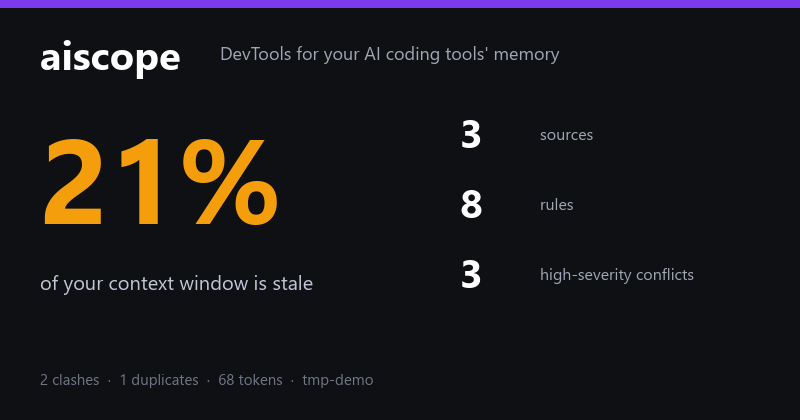

# aiscope

> **DevTools for your AI coding tools' memory.**
> See what Cursor, Claude Code, and Copilot actually remember about your project — and where they disagree.

```bash
cargo install aiscope
cd my-repo
aiscope
```



---

## The problem

You probably run 2–3 AI coding tools side-by-side: Cursor, Claude Code, Copilot, Cline, Aider… Each one stores its memory in its own private place:

```text
.cursor/rules/
.cursorrules
CLAUDE.md
.claude/agents/*.md
.github/copilot-instructions.md
.github/instructions/*.md
~/.claude/CLAUDE.md
```

**Nobody can see what their AI actually knows.** Bad rules silently override good ones. Stale rules from six months ago still steer responses. Conflicts go unnoticed until your AI confidently writes `camelCase` in a `snake_case` codebase.

`aiscope` reads them all, shows you the unified view, and flags the conflicts — with compiler-grade source spans.

---

## What it does

| Feature                        | Flag                         | What it gives you                                                   |
| ------------------------------ | ---------------------------- | ------------------------------------------------------------------- |
| **Conflict detector**          | (default)                    | Points to the exact file:line where Cursor says X and Claude says Y |
| **Unified context view**       | (TUI default)                | Every active rule in one pane, tagged by source                     |
| **Compiler-grade diagnostics** | `--diag`                     | `miette`-style output for CI logs                                   |
| **Token-budget breakdown**     | (always shown)               | "21 % of your context window is stale"                              |
| **Shareable PNG card**         | `--card out.png`             | Tweet-bait, blog post hero                                          |
| **CI mode**                    | `aiscope check`              | Exits 1 on **high-severity** conflicts only — no flapping           |
| **Watch mode**                 | `aiscope watch`              | Live re-scan on file change                                         |
| **Scriptable**                 | `--json`, `--text`, `--grep` | Pipeable into anything                                              |

---

## How it works (architecture)

aiscope is a 6-layer deterministic pipeline. **No LLM calls. No network. ~5 MB binary.**

```text
  Source files (.cursorrules, CLAUDE.md, .github/instructions/*.md, …)
    │
    ▼ Layer 0  scanner          → raw text + Source metadata
    │
    ▼ Layer 1  parse            → Statement (one bullet/paragraph + byte span)
    │   ├─ pulldown-cmark CommonMark AST
    │   ├─ skips code blocks, headings, blockquotes, HTML, YAML frontmatter
    │   └─ preserves inline-code text (so `pnpm` survives)
    │
    ▼ Layer 2  canonicalize     → CanonicalText { canon, stems }
    │   ├─ NFKC unicode normalization
    │   ├─ smart-quote / em-dash → ASCII
    │   ├─ Unicode caseless fold (Turkish-safe)
    │   ├─ punctuation strip + whitespace collapse
    │   └─ Snowball English stemming (preserves snake_case identifiers)
    │
    ▼ Layer 3a pattern extract  → Assertion { axis, value, polarity, condition }
    │   ├─ Polarity detection (Forbid / Prefer / Allow word lists)
    │   ├─ Clause splitter (.;, / but / however / whereas)
    │   ├─ Condition extractor ("in legacy code", "for tests only", …)
    │   ├─ 10 axis extractors with topic-gating (Naming, Indentation, QuoteStyle,
    │   │  PackageManager, AsyncStyle, TestColocation, TypeStrictness,
    │   │  CommentDensity, ErrorHandling, ImportStyle)
    │   └─ Confidence 0.85–0.97 per match
    │
    ▼ Layer 4  reason           → Conflict { kind, severity, confidence }
    │   ├─ Duplicate: SHA-256 fingerprint of canonicalized text (cross-source only)
    │   ├─ Clash: same axis, both Prefer, different values
    │   ├─ PolarityConflict: same value, opposite polarities
    │   └─ Severity::High iff cross-source AND combined confidence ≥ 0.85
    │
    ▼ Layer 5  diag             → miette report / TUI / JSON / PNG
```

### Why this design

The pipeline is **fully deterministic and reproducible byte-for-byte across Linux, macOS, and Windows.** That guarantee is enforced by snapshot tests in CI.

The "world-class" trick is the polarity + clause splitter:

> `"Don't use camelCase, prefer snake_case."`

The naive substring-pair detector that ships in most linters would flag this as a conflict between two rules. aiscope splits it into two clauses, sees `Forbid camelCase` and `Prefer snake_case` came from the **same statement**, and silently does nothing.

Likewise, topic-gating filters out historical narrative:

> `"We migrated from npm to pnpm last year."`

Naive: package-manager conflict. aiscope: zero assertions. (See [tests/snapshots/corpus\_\_historical_narrative.snap](tests/snapshots/corpus__historical_narrative.snap).)

---

## Privacy & safety

- **Read-only.** Never modifies your files.
- **Local only.** No telemetry, no network, no account, no API key.
- **No session-log access.** v0.1 will not open `~/.claude/projects/*.jsonl` (chat history). Only rules and instruction files. Enforced by [tests/privacy_guard.rs](tests/privacy_guard.rs) — it greps the source tree.
- **No TLS interception.** Not a proxy. Just walks your dotfiles.

---

## Tech stack

| Component                            | Why                                                              |
| ------------------------------------ | ---------------------------------------------------------------- |
| `pulldown-cmark`                     | Real CommonMark AST with byte offsets — no regex bullet parsing  |
| `unicode-normalization` + `caseless` | Unicode-correct fold (handles Turkish dotless-i, German ß, etc.) |
| `rust-stemmers`                      | Snowball English stemmer for paraphrase-resistant fingerprinting |
| `regex`                              | Polarity / axis pattern matching                                 |
| `miette`                             | Compiler-grade diagnostics with source spans (Rust-style)        |
| `tiktoken-rs`                        | Real OpenAI BPE tokenizer for token-budget math                  |
| `tiny-skia` + `cosmic-text`          | Pure-Rust PNG card render (no headless browser, no system fonts) |
| `ratatui` + `crossterm`              | TUI                                                              |
| `clap`                               | CLI parsing                                                      |
| `insta`                              | Snapshot determinism gate                                        |

Optional `semantic` feature flag (v0.2 roadmap) adds `fastembed` (bge-small-en-v1.5) for paraphrase recall on rules the pattern layer doesn't catch. Models download to `~/.cache/aiscope/` on first use.

---

## What to test

If you cloned this repo and want to verify everything works, run these in order:

```bash
# 1. Unit tests + privacy guard + smoke test + adversarial corpus snapshots
cargo test --all
# expected: 32 tests pass across 4 binaries

# 2. Lint
cargo clippy --all-targets -- -D warnings
# expected: clean

# 3. Release build size
cargo build --release
# expected: target/release/aiscope.exe ~5 MB

# 4. Live demo against the bundled fixtures
mkdir tmp-demo; mkdir tmp-demo\.github
copy tests\fixtures\cursor\.cursorrules tmp-demo\.cursorrules
copy tests\fixtures\claude\CLAUDE.md tmp-demo\CLAUDE.md
copy tests\fixtures\copilot\copilot-instructions.md tmp-demo\.github\copilot-instructions.md

# Compiler-grade output
.\target\release\aiscope.exe --diag .\tmp-demo

# Shareable card
.\target\release\aiscope.exe --card demo.png .\tmp-demo

# JSON for scripts / dashboards
.\target\release\aiscope.exe --json .\tmp-demo

# CI gate (exits 1 on high-severity conflicts)
.\target\release\aiscope.exe check .\tmp-demo; echo "exit=$LASTEXITCODE"
```

### What the demo should show

The bundled fixtures intentionally encode three real-world conflicts:

1. **Naming clash** — `.cursorrules` says `camelCase`, `CLAUDE.md` says `snake_case` for variables.
2. **Quote-style clash** — `.cursorrules` says double quotes, `CLAUDE.md` says single quotes.
3. **Duplicate** — both files have identical "Co-locate tests" rule (token waste).

`aiscope check` exits 1. The PNG card shows **21 % stale**.

### Adversarial corpus

[tests/corpus/](tests/corpus/) contains 5 hand-written tricky markdown documents that exercise the pipeline's edge cases:

| Fixture                   | What it tests                                                    |
| ------------------------- | ---------------------------------------------------------------- |
| `negation_clause.md`      | `"Don't X, prefer Y"` → 2 clauses, no self-clash                 |
| `historical_narrative.md` | `"We migrated from npm to pnpm"` → 0 false positives             |
| `conditional_clauses.md`  | `"snake_case in legacy, camelCase in new"` → conditions captured |
| `frontmatter_and_code.md` | YAML frontmatter + fenced code + blockquote all skipped          |
| `multi_axis.md`           | Indentation + comment density + import style in 3 lines          |

Outputs are pinned in [tests/snapshots/](tests/snapshots/). To accept intentional changes:

```bash
cargo insta review
```

---

## Roadmap

- v0.2 — `semantic` feature: fastembed paraphrase detection, MCP server inventory, opt-in session-log scanning, git-aware memory diff
- v0.3 — `aiscope traffic` proxy mode (live cost monitoring)
- v0.4 — hosted shareable snapshot URLs
- v0.5 — cross-tool memory port (`aiscope port cursor → claude`)

## Contributing

See [CONTRIBUTING.md](CONTRIBUTING.md). The bar for new axis extractors:

1. Add a variant to `Axis` and `AxisValue` in [src/model/mod.rs](src/model/mod.rs).
2. Add a fn in [src/extract/pattern.rs](src/extract/pattern.rs) and register it in `EXTRACTORS`.
3. Add a fixture under `tests/corpus/` and run `cargo insta review`.
4. The new axis must produce **zero** false positives on the existing corpus.

## License

MIT
